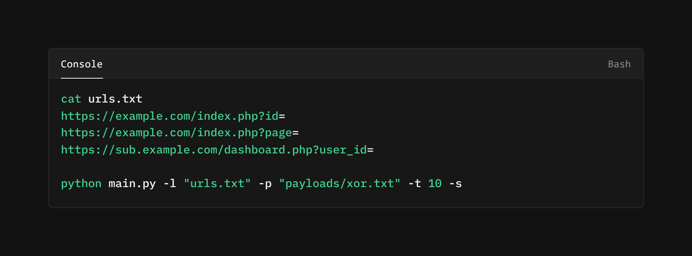
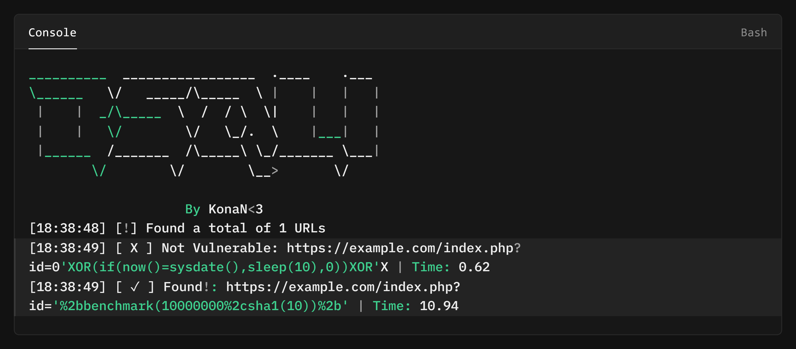

<h4 align="center">Fast and customisable vulnerability scanner based on simple SQL payloads.</h4>


<p align="center">
<a href="https://github.com/KKonaNN/bsqli/releases">
<a href="https://github.com/KKonaNN/bsqli/graphs/contributors">
<a href="https://github.com/KKonaNN/bsqli/releases/">
<a href="https://github.com/KKonaNN/bsqli/issues">
<a href="https://github.com/KKonaNN/bsqli/discussions">
</p>
      
<p align="center">
  <a href="#how-it-works">How</a> •
  <a href="#install-Bsqli">Install</a> •
  <a href="https://discord.gg/luauth">Join Discord</a>
</p>

---

Bsqli is used to send requests across targets based on a payload list, leading to almost zero false positives and providing fast scanning on a large number of hosts, With powerful and flexible payload list, Bsqli can be used to find all kinds of sql vulns.

## How it works


<h3 align="center">
  </a>
      </a>
</h3>

# Install Bsqli

Bsqli requires **python3** to run successfully. Run the following command to install the latest version -

```sh
git clone -v https://github.com/KKonaNN/bsqli.git
```

### Usage

```sh
python3 main.py -h
```

This will display help for the tool. Here are all the switches it supports.


```console
Bsqli is a fast Blind SQL LIKE CLAUSE Data Exfiltration Tool

Usage:
  python3 bsqli.py [flags]

Flags:
usage: main.py [-h] (-u URL | -l FILE) -p PAYLOADS [-t THREADS] [-o OUTPUT] [-hf] [-s]

Proof of Concept Blind SQL LIKE CLAUSE Data Exfiltration Tool

options:
  -h, --help            show this help message and exit
  -u URL, --url URL     Target URL
  -l FILE, --file FILE  URLs file
  -p PAYLOADS, --payloads PAYLOADS
                        Payloads file
  -t THREADS, --threads THREADS
                        Number of threads
  -o OUTPUT, --output OUTPUT
                        Output file for results
  -hf, --hide-fail, --hide-fails
                        Hide failed attempts
  -s, --no-ssl-verify   Disable SSL verification
```
